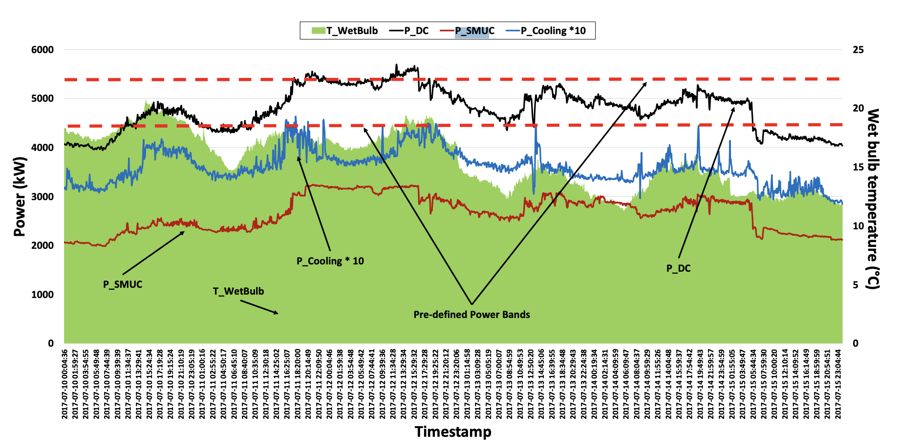

# Data center 

## 1. National data center electricity consumption

### 1.1 TYNDP

DE: Distributed Energy scenario;GA: Global Ambition scenario

data source: https://2024.entsos-tyndp-scenarios.eu/download/ 20230704- Draft Demand Scenarios TYNDP 2024


| STUDY | COUNTRY | TYPE | UNIT | 2019 | 2040 (DE) | 2050 (DE) | 2040 (GA) | 2050 (GA) |
|--------|----------|--------|------|------|------------|------------|------------|------------|
| TYNDP2024 | AT | Output | TWh | 1,5 | 1,6 | 1,1 | 1,6 | 1,1 |
| TYNDP2024 | BE | Output | TWh | 1,8 | 2,5 | 28,7 | 2,1 | 16,2 |
| TYNDP2024 | BG | Output | TWh | 1,4 | 1,9 | 2,0 | 1,6 | 1,7 |
| TYNDP2024 | CY | Output | TWh | 0,2 | 0,2 | 0,2 | 0,2 | 0,2 |
| TYNDP2024 | CZ | Output | TWh | 1,9 | 2,5 | 2,6 | 2,1 | 2,3 |
| TYNDP2024 | DE | Output | TWh | 18,3 | 44,5 | 49,7 | 44,5 | 49,7 |
| TYNDP2024 | DK | Output | TWh | 1,5 | 1,9 | 1,7 | 2,0 | 2,4 |
| TYNDP2024 | EE | Output | TWh | 0,4 | 0,5 | 0,5 | 0,4 | 0,4 |
| TYNDP2024 | ES | Output | TWh | 6,4 | 6,5 | 9,4 | 6,5 | 9,4 |
| TYNDP2024 | FI | Output | TWh | 1,3 | 5,9 | 5,4 | 5,9 | 5,4 |
| TYNDP2024 | FR | Output | TWh | 11,2 | 20,9 | 23,7 | 20,9 | 23,7 |
| TYNDP2024 | GR | Output | TWh | 1,1 | 1,4 | 1,5 | 1,2 | 1,3 |
| TYNDP2024 | HR | Output | TWh | 0,6 | 0,8 | 0,9 | 0,7 | 0,8 |
| TYNDP2024 | HU | Output | TWh | 1,8 | 2,4 | 2,5 | 2,1 | 2,2 |
| TYNDP2024 | IE | Output | TWh | 1,4 | 19,3 | 21,4 | 16,7 | 18,6 |
| TYNDP2024 | IT | Output | TWh | 7,0 | 17,0 | 21,0 | 17,0 | 21,0 |
| TYNDP2024 | LT | Output | TWh | 0,5 | 0,6 | 0,7 | 0,5 | 0,6 |
| TYNDP2024 | LU | Output | TWh | 0,2 | 0,3 | 0,4 | 0,3 | 0,3 |
| TYNDP2024 | LV | Output | TWh | 0,5 | 0,6 | 0,6 | 0,5 | 0,6 |
| TYNDP2024 | MT | Output | TWh | 0,0 | 0,0 | 0,0 | 0,0 | 0,0 |
| TYNDP2024 | NL | Output | TWh | 4,0 | 16,4 | 16,4 | 11,1 | 16,4 |
| TYNDP2024 | PL | Output | TWh | 5,1 | 9,0 | 9,2 | 5,9 | 6,3 |
| TYNDP2024 | PT | Output | TWh | 1,5 | 2,0 | 2,1 | 1,7 | 1,8 |
| TYNDP2024 | RO | Output | TWh | 2,5 | 3,4 | 3,5 | 2,9 | 3,1 |
| TYNDP2024 | SE | Output | TWh | 3,1 | 37,2 | 53,0 | 28,7 | 53,0 |
| TYNDP2024 | SI | Output | TWh | 0,4 | 0,5 | 0,5 | 0,4 | 0,4 |
| TYNDP2024 | SK | Output | TWh | 0,9 | 1,2 | 1,3 | 1,0 | 1,1 |
| TYNDP2024 | UK | Output | TWh | 1,5 | 2,0 | 2,1 | 1,7 | 1,8 |
| TYNDP2024 | EU | Output | TWh | 76,4 | 201,3 | 260,0 | 178,7 | 240,1 |

### 1.2 NEP

data source: https://www.netzentwicklungsplan.de/sites/default/files/2025-04/250430_Genehmigung_Szenariorahmen_2025_0.pdf

| Stromverbrauch [TWh] | Szenario A 2037 | Szenario B 2037 | Szenario C 2037 | Szenario A 2045 | Szenario B 2045 | Szenario C 2045 |
|------------------------|----------------|----------------|----------------|----------------|----------------|----------------|
| DE | 78,4 | 97,3 | 116,2 | 78,4 | 97,3 | 116,2 |

*Tabelle 9: Stromverbrauch von Rechenzentren*


### 1.3 ICIS

data source: https://www.icis.com/explore/resources/data-centres-hungry-for-power/

| Country [TWh] | 2024 | 2025 | 2026 | 2027 | 2028 | 2029 | 2030 | 2031 | 2032 | 2033 | 2034 | 2035 |
| :------ | ---: | ---: | ---: | ---: | ---: | ---: | ---: | ---: | ---: | ---: | ---: | ---: |
| DE      | 20,6 | 22,4 | 24,3 | 26,3 | 28,3 | 30,5 | 32,7 | 34,9 | 37,2 | 39,5 | 41,7 | 43,9 |
| FR      | 11,0 | 12,2 | 13,4 | 14,7 | 16,1 | 17,5 | 19,0 | 20,5 | 22,1 | 23,7 | 25,2 | 26,8 |
| UK      | 12,6 | 13,4 | 14,3 | 15,2 | 16,1 | 17,1 | 18,1 | 19,1 | 20,1 | 21,1 | 22,1 | 23,1 |
| NO      |  3,9 |  4,9 |  6,0 |  7,1 |  8,2 |  9,4 | 10,6 | 11,9 | 13,1 | 14,3 | 15,5 | 16,7 |
| SE      |  2,9 |  3,8 |  4,8 |  5,8 |  6,8 |  7,9 |  9,1 | 10,2 | 11,4 | 12,6 | 13,7 | 14,9 |
| IE      |  6,8 |  7,5 |  8,1 |  8,8 |  9,4 | 10,1 | 10,7 | 11,4 | 12,0 | 12,6 | 13,1 | 13,6 |
| NL      |  8,4 |  8,8 |  9,3 |  9,7 | 10,2 | 10,7 | 11,2 | 11,7 | 12,2 | 12,7 | 13,1 | 13,6 |
| ES      |  5,3 |  5,8 |  6,4 |  7,0 |  7,6 |  8,3 |  9,1 |  9,8 | 10,6 | 11,3 | 12,1 | 12,9 |
| IT      |  3,6 |  4,1 |  4,6 |  5,1 |  5,7 |  6,3 |  7,0 |  7,7 |  8,4 |  9,2 |  9,9 | 10,7 |
| DK      |  2,0 |  2,6 |  3,3 |  4,0 |  4,7 |  5,4 |  6,1 |  6,8 |  7,5 |  8,2 |  8,9 |  9,5 |
| FI      |  1,5 |  1,8 |  2,2 |  2,6 |  3,0 |  3,5 |  3,9 |  4,4 |  4,9 |  5,3 |  5,8 |  6,3 |
| CH      |  2,4 |  2,6 |  2,9 |  3,2 |  3,5 |  3,8 |  4,1 |  4,5 |  4,8 |  5,1 |  5,4 |  5,7 |
| BE      |  2,2 |  2,5 |  2,7 |  3,0 |  3,2 |  3,5 |  3,8 |  4,1 |  4,4 |  4,7 |  5,0 |  5,4 |
| PL      |  2,7 |  2,9 |  3,0 |  3,2 |  3,4 |  3,5 |  3,7 |  3,9 |  4,2 |  4,4 |  4,6 |  4,8 |
| AT      |  1,2 |  1,5 |  1,8 |  2,0 |  2,3 |  2,6 |  3,0 |  3,3 |  3,6 |  4,0 |  4,3 |  4,6 |
| PT      |  1,1 |  1,2 |  1,4 |  1,6 |  1,8 |  2,1 |  2,3 |  2,5 |  2,8 |  3,0 |  3,3 |  3,5 |
| CZ      |  1,3 |  1,5 |  1,7 |  1,8 |  2,0 |  2,2 |  2,4 |  2,6 |  2,8 |  3,1 |  3,3 |  3,5 |
| RO      |  1,6 |  1,7 |  1,8 |  1,9 |  2,0 |  2,2 |  2,3 |  2,5 |  2,6 |  2,8 |  3,0 |  3,1 |
| HU      |  0,5 |  0,6 |  0,7 |  0,8 |  0,9 |  1,0 |  1,2 |  1,3 |  1,5 |  1,6 |  1,8 |  1,9 |
| BG      |  1,0 |  1,0 |  1,1 |  1,2 |  1,3 |  1,3 |  1,4 |  1,5 |  1,6 |  1,7 |  1,8 |  1,9 |
| SK      |  0,5 |  0,6 |  0,7 |  0,8 |  0,9 |  1,1 |  1,2 |  1,3 |  1,4 |  1,6 |  1,7 |  1,9 |
| GR      |  0,5 |  0,6 |  0,7 |  0,8 |  0,9 |  1,0 |  1,1 |  1,2 |  1,3 |  1,4 |  1,5 |  1,7 |
| HR      |  0,6 |  0,6 |  0,7 |  0,7 |  0,8 |  0,9 |  0,9 |  1,0 |  1,1 |  1,1 |  1,2 |  1,3 |
| LT      |  0,6 |  0,7 |  0,7 |  0,8 |  0,8 |  0,9 |  0,9 |  1,0 |  1,1 |  1,1 |  1,2 |  1,2 |
| SI      |  0,5 |  0,6 |  0,6 |  0,7 |  0,7 |  0,8 |  0,9 |  0,9 |  1,0 |  1,1 |  1,1 |  1,2 |
| EE      |  0,4 |  0,5 |  0,5 |  0,5 |  0,6 |  0,6 |  0,7 |  0,7 |  0,8 |  0,8 |  0,9 |  0,9 |
| LV      |  0,3 |  0,4 |  0,4 |  0,5 |  0,5 |  0,5 |  0,6 |  0,6 |  0,7 |  0,7 |  0,8 |  0,8 |
| CY      |  0,0 |  0,1 |  0,1 |  0,1 |  0,1 |  0,1 |  0,1 |  0,2 |  0,2 |  0,2 |  0,2 |  0,2 |


### 1.4 andere

| Land | Strommenge (TWh) | Quelle |
|-------|------------------|---------|
| DE | 18 TWh im Jahr 2022 | European Commission, 2024, https://www.ca-eed.eu/ia-document/implementing-the-eed-data-centers-and-the-german-energy-efficiency-act-germany/?utm_source=chatgpt.com |
| BE | ± 1,5 im Jahr 2021 | European Commission, 2024 |
| DK | 1,3 im Jahr 2021 | European Commission, 2024 |
| FI | ± 0,7 im Jahr 2018 | European Commission, 2024 |
| FR | 10 – 12 im Jahr 2018 | European Commission, 2024 |
| IE | 5,25 im Jahr 2022 | CSO, 2023 |
| IT | ± 4,25 | European Commission, 2024 |
| NL | 3,7 im Jahr 2021 | CBS, 2022 |
| NO | 1,5 im Jahr 2023 | Norsk Datasenterindustri, 2024 |
| PL | ± 2 | European Commission, 2024 |
| ES | ± 2,9 | European Commission, 2024 |
| SE | 3 im Jahr 2022 | European Commission, 2024 |
| GB | 9 – 10 TWh im Jahr 2020 | TechUK, 2020 |

## 2. Germany data center list

### 2.1 result


The data can be obtained from GitHub according to the file structure shown below.

```
datacenter/
│
├── DE_datacenter_list/  
    |-- cloudscene_2024.csv  the data from cloudscene 
    |-- mapdatacenter_2024.csv   the data from mapdatacenter 

```

You can also retrieve the data from SharePoint:

- **cloudscene_2024.csv**: [https://rlinstitutde.sharepoint.com/:x:/s/374_Retail4Multi-Use-374_internal_Team/EWqbkza6pPBJmhBChm8fCI4BwTvtMNlOE0ux3Nun_gYlhQ?e=Jkaw5j](https://rlinstitutde.sharepoint.com/:x:/s/374_Retail4Multi-Use-374_internal_Team/EWqbkza6pPBJmhBChm8fCI4BwTvtMNlOE0ux3Nun_gYlhQ?e=Jkaw5j)

- **mapdatacenter_2024.csv**: [https://rlinstitutde.sharepoint.com/:x:/s/374_Retail4Multi-Use-374_internal_Team/EbqOKUEaBF9MqohizaosTt4Bu9RuvnPJQBpNCaE8rgT2Xw?e=rgQrCl](https://rlinstitutde.sharepoint.com/:x:/s/374_Retail4Multi-Use-374_internal_Team/EbqOKUEaBF9MqohizaosTt4Bu9RuvnPJQBpNCaE8rgT2Xw?e=rgQrCl)


The meanings of the column names in the data: 
| Column Name                     | Description                                                                                | Unit     |
| ------------------------------- | ------------------------------------------------------------------------------------------ | -------- |
| **id**                          | Unique identifier for each data center.                                                    | —        |
| **name**                        | Name of the data center, usually includes brand or location.                               | —        |
| **company_name**                | Company or organization that operates the data center.                                     | —        |
| **m2**                          | Floor area of the data center building or white space area.                                | m²       |
| **gross_max_power**             | Reported maximum electrical power capacity (raw value, possibly with units).               | MW |
| **lon**                         | Longitude coordinate of the data center location.                                          | degrees  |
| **lat**                         | Latitude coordinate of the data center location.                                           | degrees  |
| **search**                      | The keyword used for searching on the map | —        |
| **Punktgeometrie (als WKT)**    | Point geometry in WKT (Well-Known Text) format representing the geographic coordinates.    | —        |
| **source**                      | Source of the data (cloudscene, mapdatacenter).                      | —        |
| **estimated_max_power_mw**      | Estimated maximum power capacity of the facility.                                          | MW       |
| **estimation_method**           | Method used to estimate the maximum power capacity  | —        |
| **facility_type**               | Type of data center ( colocation, enterprise, hyperscale, etc.).                      | —        |
| **estimated_annual_energy_mwh** | Estimated annual electricity consumption.                                                  | MWh      |

### 2.2 Source of data

The data centers in Germany can be obtained from the following websites.

https://cloudscene.com/market/data-centers-in-germany/all
 – Over 500 data centers, most with performance data. I couldn’t find a method for bulk downloading.

https://map.datacente.rs/
 – Over 500 data centers, some with performance data, and a list is available.

https://www.datacentermap.com/germany/
 – Over 500 data centers. A fee is required to download the complete data in bulk.

https://www.datacenters.com/locations/germany
 – Over 200 data centers, few with performance data. No download method found.

From the perspective of data quality and accessibility, I used web scraping to obtain data from **Cloudscene** and **map.datacente.rs**.


### 2.3 Evaluation method

The original data were obtained from Cloudscene and MapDataCenter.
As no reliable method was available to identify and remove duplicate data centers between the two sources, each dataset was assumed to independently represent the complete set of data centers located in Germany.

Given the substantial amount of missing information in the original records, the variables `estimated_max_power_mw` and `estimated_annual_energy_mwh` were derived using the estimation methodology described below.

#### Step 1: Facility Type Classification  
Facility type is inferred from company and site names using keyword patterns.  
- **Colocation**: e.g., Equinix, Interxion, Digital Realty, etc.  
- **Hosting / Cloud**: e.g., AWS, Google, Microsoft, Hetzner, OVH, IONOS, etc.  
- **Enterprise**: e.g., T-Systems, IBM, Atos, etc.  
- Others are classified as **Unknown**.  

The facility type determines the assumptions for power density, PUE (Power Usage Effectiveness), and load factor used in later steps.

---

#### Step 2: Estimating Maximum Power (MW)  
1. **Use reported values if available**  
   If `gross_max_power` is reported and greater than zero, it is used directly as the site’s maximum power.

2. **Estimate from floor area if not reported**  
   If area data (m²) is available, total site power is estimated using IT power density and PUE by facility type:  
   \[
   \text{Max Power (MW)} = \frac{\text{Area (m²)} \times \text{Power Density (kW/m²)} \times \text{PUE}}{1000}
   \]

   | Facility Type | Power Density (kW/m²) | PUE |
   |----------------|-----------------------|-----|
   | Colocation     | 1.5                   | 1.50 |
   | Hosting/Cloud  | 1.8                   | 1.35 |
   | Enterprise     | 1.0                   | 1.60 |
   | Unknown        | 1.2                   | 1.50 |

The source of the data is:
https://post-und-telekommunikation.de/PuT/1Fundus/Dokumente/Studien/BITKOM/2014-Borderstep_Institut-Studie_Rechenzentren_in_Deutschland_05-05-2014%281%29.pdf?utm_source=chatgpt.com

1. **Company-level mean fallback**  
   If both reported power and area are missing, the **company mean** of already estimated sites is used:  
   - The mean is calculated from all other sites belonging to the same company that already have valid estimates.  
   - This assumes similar design and scale across a company’s data centers.

2. **Global median fallback**  
   If the company has no valid data at all, the **global median** of all estimated maximum powers is used as a final fallback.

---

#### Step 3: Estimating Annual Electricity Use (MWh)  
Annual energy use is derived from estimated maximum power and a load factor assigned by facility type:  
\[
\text{Annual Energy (MWh)} = \text{Max Power (MW)} \times \text{Load Factor} \times 5000 
\]

| Facility Type | Load Factor |
|----------------|-------------|
| Colocation     | 0.65 |
| Hosting/Cloud  | 0.60 |
| Enterprise     | 0.50 |
| Unknown        | 0.55 |

---

The full-load hours of 5,000 are derived from the NEP.
The source of the load factor data is:
https://post-und-telekommunikation.de/PuT/1Fundus/Dokumente/Studien/BITKOM/2014-Borderstep_Institut-Studie_Rechenzentren_in_Deutschland_05-05-2014%281%29.pdf?utm_source=chatgpt.com


#### Step 4: National Energy Scaling (Energy Only)  
The total of all site-level annual energy estimates is scaled to match a national target (default **20.6 TWh/year**):  
\[
\text{Scaled Energy} = \text{Original Estimate} \times \frac{\text{Target Total}}{\text{Current Total}}
\]
Only annual energy values are scaled; **maximum power estimates remain unchanged**.

---

#### Step 5: Output  
- Two key quantitative results are retained and rounded to two decimals:  
  - `estimated_max_power_mw` — estimated site maximum power  
  - `estimated_annual_energy_mwh` — scaled annual electricity use  
- The output also includes `facility_type` and `estimation_method` columns for traceability.  
- The final dataset is exported as a semicolon-separated CSV file.

---

This methodology combines reported data, physical modeling (area and density), company-level aggregation, and national scaling to provide consistent, transparent energy estimates for each German data center.

### 2.4 Limitations

1. Most data centers are missing values — many figures are based on estimates.  
2. Naming conventions differ between cloudscene and mapdatacenter, making deduplication difficult.  
3. The scaling assumes we already have the complete list of all data centers. If this is not true, energy consumption figures will be biased.

### 2.5 Borderstep’s Evaluation Method

For reference, the evaluation approach used by Borderstep is outlined below.

Borderstep estimates data center electricity consumption based on the total number of hardware devices sold in the market.

Because the method relies on aggregated market data rather than site-specific measurements, it cannot predict the electricity consumption of an individual data center.The detailed estimation procedure is as follows:

#### Step 1: Define System Boundaries and Categories
Define the scope of analysis, including:
- Different types of data centers (enterprise-owned, colocation, and cloud);
- Smaller IT installations such as server rooms and communication nodes.  

Facilities are grouped by size and function so that appropriate operational and efficiency parameters can be assigned.

---

#### Step 2: Build IT Equipment Stock and Age Structure
Borderstep constructs an inventory of IT equipment operating in Germany using market data and lifetime assumptions.  
This includes servers, storage systems, and networking equipment.  
The stock model reflects sales, replacements, and decommissioning to capture the total number of active devices and their generational mix.

---

#### Step 3: Determine Power Characteristics and Utilization
Each equipment class is assigned representative power profiles and utilization levels.  
These reflect how devices operate under different loads and usage patterns throughout the year.  
From this, the total IT-side energy consumption is derived by summing across all device types.

---

#### Step 4: Add Infrastructure Energy (Using PUE)
The model incorporates additional energy used by supporting infrastructure such as cooling, UPS, and power distribution.  
This is achieved by applying **Power Usage Effectiveness (PUE)** factors to the IT-side consumption.  
Different categories of data centers are assigned distinct PUE values based on their efficiency level and design.

---

#### Step 5: Weighted Aggregation by Type
Each data center category (by size, purpose, utilization, and PUE) is modeled separately and aggregated into a national total.  
This step also takes into account operational factors such as equipment utilization rates, rack density, and technological improvements.

---

#### Step 6: Parameter Calibration and Trend Extrapolation
Model parameters are calibrated using:
- Industry surveys and operator questionnaires;
- Market data from research organizations;
- Reported energy and capacity data from large operators.  

The model is updated annually to maintain consistency with the latest technological and market developments.

---

#### Step 7: Output and Reporting
The model produces:
- National annual electricity demand estimates;
- Breakdowns by facility type and function;
- Separate results for IT equipment and supporting infrastructure;
- Scenario projections for future efficiency and growth developments.

#### References
1. **Borderstep Institute (2022)** – *Rechenzentren in Deutschland 2021 – Energy Demand and Climate Protection Potentials.*  
   https://www.borderstep.de/wp-content/uploads/2022/08/Borderstep_Rechenzentren_2021_eng.pdf

2. **Borderstep Institute (2024)** – *Server Stock Data – Methodological Note for EGG 2024.*  
   https://www.borderstep.de/wp-content/uploads/2024/06/Server-stock-data-EGG2024.pdf

3. **Bitkom (2023)** – *Study: Data Centers in Germany 2023* (conducted by Borderstep).  
   https://www.bitkom.org/sites/main/files/2023-05/BitkomStudieRechenzentreninDeutschland2023.pdf

4. **Borderstep Institute (2023)** – *Rechenzentren 2022 – Final Report.*  
   https://www.borderstep.de/wp-content/uploads/2023/08/Borderstep_Rechenzentren2022_final.pdf


## 3. Example Hourly Energy Consumption Data for Data Centers

### 3.1 Typical Data

Hourly power data for a **typical data center in Germany** can be obtained from the following location:

```
datacenter/
├── typical_data/  
    |-- typical 
         |-- mapdatacenter_2024.csv   the data from mapdatacenter 

```


Alternatively, it can be retrieved from SharePoint:  
[[datacenter_hourly_power](https://rlinstitutde.sharepoint.com/:x:/s/374_Retail4Multi-Use-374_internal_Team/ERaXLuFjgRRIk3sv1dRwWFABGBqdIvUQgD1AVp5O5wvSvQ?e=I1jLoH)](https://rlinstitutde.sharepoint.com/:x:/s/374_Retail4Multi-Use-374_internal_Team/ERaXLuFjgRRIk3sv1dRwWFABGBqdIvUQgD1AVp5O5wvSvQ?e=I1jLoH)


The data is generated according to the following rules:
1. The **maximum installed capacity** is set to **1 MW**; other data center capacities can be obtained by scaling this value.
2. The **full-load hours** are set to **500 MW**.
3. The **periodic components** after Fourier transformation are based on reference examples (see below), mainly referring to the **Honda R&D Data Center Building** in **Hesse, Germany**. Its characteristic data are shown in the table below:

| Frequency (cycles/day) | Period (days) | Amplitude (A) | Phase (rad) | Estimated Energy Share | Peak Time* (days) | Notes                                                                                                                |
| ---------------------: | ------------: | ------------: | ----------: | ---------------------: | ----------------: | -------------------------------------------------------------------------------------------------------------------- |
|             **1.0000** |       **1.0** |    **0.4350** | **+3.0838** |           **≈ 13.6 %** |            ≈ 0.49 | Daily cycle — represents diurnal operational or thermal variation (e.g., day–night cooling demand).                  |
|         **0.00273848** |    **365.17** |    **1.0000** | **−0.2514** |           **≈ 72.0 %** |            ≈ 14.6 | Annual/seasonal component — dominant term, likely driven by long-term climate or temperature effects on power usage. |
|         **0.14285714** |       **7.0** |    **0.4000** | **−2.2116** |           **≈ 14.4 %** |            ≈ 2.47 | Weekly cycle — smaller contribution, reflecting operational scheduling or weekly workload patterns.                  |
|              **Total** |             — |             — |           — |              **100 %** |                 — | Energy shares normalized to 1.0                                                                                      |
                                                                      |

**Notes when using this dataset:**
1. The generated data corresponds to the **year 2023**. If switching to another year, ensure that **weekdays and weekends** are properly aligned.
2. The dataset assumes that both **heating and power supply** are provided **entirely by electricity**.The current assumption is that the heating efficiency is **100%**.
3. At present, only the general seasonal variations in weather are considered, while specific daily weather data are not taken into account.


   


### 3.2 Analysis of Publicly Available Data Center Electricity Consumption

Most data centers do not disclose their power consumption data. The following presents all publicly available datasets and their periodicity analysis results.

---

#### 3.2.1 Leibniz Supercomputing Centre (Germany)
**Data source:** Hourly electricity consumption for 5 days in July 2017  
[Dataset link (page 4)](https://gwdg.de/hpc/_publications/iobassfeac19/publication.pdf)



**Data description:**  
Only 5 consecutive days of hourly power data in July 2017, provided as a figure.

**Periodicity analysis:**  
Because the dataset covers only five days, reliable Fourier spectral analysis cannot be performed. From the figure, a clear daily fluctuation can be observed: daytime power consumption is higher and nighttime lower, with an intra-day peak-to-valley difference of about 10–15%. No weekly or longer periodic components are visible. The dataset can only be used for qualitative analysis of daily variations.

---

#### 3.2.2 Honda R&D Data Center Building (Hesse, Germany)
**Data source:** Hourly data from 2018–2023  
[Dataset link](https://www.nature.com/articles/s41597-025-05186-3?error=cookies_not_supported&code=a51bcf1e-e965-4bcf-8d7a-378ea4144d59)

**Fourier Transform Results:**  
1. Frequency = 1.0000 cycles/day, Amplitude = 67,578.93 (norm=1.0000), Period = 1.000 days (24.0 h), Phase = 3.084 rad, Peak at 50.9% of cycle (~12.2 h after start)
2. Frequency = 0.1429 cycles/day, Amplitude = 56,977.03 (norm=0.8431), Period = 7.000 days (168.0 h), Phase = -2.212 rad, Peak at 35.2% of cycle (~59.1 h after start)
3. Frequency = 1.0005 cycles/day, Amplitude = 33,210.36 (norm=0.4914), Period = 1.000 days (24.0 h), Phase = -0.011 rad, Peak at 0.2% of cycle (~0.0 h after start)
4. Frequency = 0.9995 cycles/day, Amplitude = 30,982.98 (norm=0.4585), Period = 1.000 days (24.0 h), Phase = -0.056 rad, Peak at 0.9% of cycle (~0.2 h after start)
5. Frequency = 0.1433 cycles/day, Amplitude = 28,981.28 (norm=0.4289), Period = 6.978 days (167.5 h), Phase = 1.042 rad, Peak at 83.4% of cycle (~139.7 h after start)


**Periodicity analysis:**  
he spectral results show strong and consistent periodicities primarily concentrated in the daily (1.0 cycle/day) and weekly (~0.14 cycles/day) ranges.
The dominant daily component exhibits the largest amplitude (~67,579), peaking around midday (≈12 hours after start), indicating a pronounced diurnal rhythm.
The weekly component (7-day period) is also strong, suggesting a stable cyclic pattern across weeks.
Two nearby daily sidebands (0.9995 and 1.0005 cycles/day) indicate minor modulation effects or slight phase shifts between consecutive days.
Overall, the system displays a multi-period composite behavior dominated by the daily and weekly harmonics, reflecting both short-term regularity and weekly structural patterns in the data.

---

#### 3.2.3 NREL RSF Measured Data 2011 (USA)
**Data source:** Hourly data from the National Renewable Energy Laboratory Research Support Facility  
[Dataset link](https://catalog.data.gov/dataset/nrel-rsf-measured-data-2011-c7c02)

**Fourier Transform Results:**  
1. Frequency = 0.0027 cycles/day, Amplitude = 89.42(norm=1.0000), Period = 365.000 days (8760.0 h), Phase = -0.251 rad, Peak at 4.0% of cycle (~350.5 h after start)  
2. Frequency = 1.0000 cycles/day, Amplitude = 39.14(norm=0.4377), Period = 1.000 days (24.0 h), Phase = -3.094 rad, Peak at 49.2% of cycle (~11.8 h after start)  
3. Frequency = 0.9973 cycles/day, Amplitude = 32.38(norm=0.3621), Period = 1.003 days (24.1 h), Phase = -0.238 rad, Peak at 3.8% of cycle (~0.9 h after start)  
4. Frequency = 0.1425 cycles/day, Amplitude = 29.71(norm=0.3322), Period = 7.019 days (168.5 h), Phase = 2.779 rad, Peak at 55.8% of cycle (~93.9 h after start)  
5. Frequency = 0.0110 cycles/day, Amplitude = 26.82(norm=0.2999), Period = 91.250 days (2190.0 h), Phase = -2.247 rad, Peak at 35.8% of cycle (~783.0 h after start)

**Periodicity analysis:**  
The data clearly show dominant 24-hour and 365-day cycles, accompanied by secondary 7-day and ~90-day components. The amplitude of the annual cycle (A=89.4) is the largest, indicating a strong yearly modulation, while the daily and weekly components show stable short-term repetition. Overall, the power consumption follows a layered periodic pattern combining daily, weekly, and annual frequencies.

---

#### 3.2.4 TÜBİTAK ULAKBİM (Turkey)
**Data source:** Daily electricity data from 2018–2021  
[Source document](https://stat.metu.edu.tr/en/system/files/sustainability_of_metaverse.pdf)

**Data description:**  
Only graphical daily data are available; raw numerical data were not published.

**Periodicity analysis:**  
From the available plots, a clear annual seasonal pattern can be observed: higher electricity consumption between April and September (75,000–80,000 kWh/day) and lower between October and March (60,000–70,000 kWh/day). This cycle repeats each year with consistent amplitude, confirming a strong annual periodicity. The lack of higher-resolution data prevents analysis of shorter cycles such as weekly or daily fluctuations.

---

#### 3.2.5 Kasetsart University Data Center (Thailand)
**Data source:** Hourly data from July 2018 to April 2022  
[Raw data](https://www.scidb.cn/en/detail?dataSetId=60dfb844a69842c1b7e7ca3ba8e09791)  
[Paper](https://energyinformatics.springeropen.com/articles/10.1186/s42162-024-00327-1)

**Fourier Transform Results:**  
1. Frequency = 0.0007 cycles/day, Amplitude = 22,579.43, Period = 1447.250 days (34,734.0 h), Phase = 2.820 rad, Peak at 55.1% of cycle (~19,142.6 h after start)  
2. Frequency = 0.9998 cycles/day, Amplitude = 7,121.50, Period = 1.000 days (24.0 h), Phase = -2.007 rad, Peak at 31.9% of cycle (~7.7 h after start)  
3. Frequency = 0.0035 cycles/day, Amplitude = 6,944.74, Period = 289.450 days (6,946.8 h), Phase = -2.745 rad, Peak at 43.7% of cycle (~3,034.8 h after start)  
4. Frequency = 0.0028 cycles/day, Amplitude = 6,384.31, Period = 361.812 days (8,683.5 h), Phase = 0.076 rad, Peak at 98.8% of cycle (~8,578.4 h after start)  
5. Frequency = 0.0111 cycles/day, Amplitude = 5,766.40, Period = 90.453 days (2,170.9 h), Phase = -0.947 rad, Peak at 15.1% of cycle (~327.2 h after start)

**Periodicity analysis:**  
The dataset shows a distinct 24-hour cycle with peak power around 7–8 hours each day, combined with clear annual (~362 days), quarterly (~90 days), and medium-term (~289 days) components. A very low-frequency trend (~1447 days) represents a long-term baseline change. The amplitude distribution among major frequencies is relatively balanced, indicating consistent multi-period behavior across daily, seasonal, and long-term scales.Because this dataset comes from a university, electricity consumption is strongly affected by academic breaks and holidays; therefore, the annual cycle cannot be reliably used.

---

#### 3.2.6  HP Z440 Workstation (Ecuador)
**Data source:** One-second sampling data for 245 days (35 weeks)  
[Dataset link](https://ieee-dataport.org/open-access/data-server-energy-consumption-dataset)

**Fourier Transform Results:**  
1. Frequency = 0.0141 cycles/day, Amplitude = 22.24(norm=1.0000), Period = 70.819 days (1,699.7 h), Phase = 2.844 rad, Peak at 54.7% of cycle (~930.3 h after start)  
2. Frequency = 0.0094 cycles/day, Amplitude = 21.78(norm=0.9792), Period = 106.229 days (2,549.5 h), Phase = -0.892 rad, Peak at 14.2% of cycle (~361.9 h after start)  
3. Frequency = 0.0047 cycles/day, Amplitude = 21.26(norm=0.9557), Period = 212.458 days (5,099.0 h), Phase = 1.310 rad, Peak at 79.1% of cycle (~4,035.8 h after start)  
4. Frequency = 0.0424 cycles/day, Amplitude = 12.39(norm=0.5571), Period = 23.606 days (566.6 h), Phase = -2.234 rad, Peak at 35.6% of cycle (~201.5 h after start)  
5. Frequency = 0.0471 cycles/day, Amplitude = 11.84(norm=0.5324), Period = 21.246 days (509.9 h), Phase = 1.619 rad, Peak at 74.2% of cycle (~378.5 h after start)

**Periodicity analysis:**  
Because this dataset represents a single machine rather than a full data center, the data are excluded from analysis.The spectrum is dominated by medium-term oscillations ranging between 21–106 days, with amplitudes between 11 and 22. Several adjacent low-frequency components indicate mid-scale fluctuations, while no significant peaks appear near 1.0 cycle/day, suggesting that daily periodicity is weak. Because the dataset covers only 245 days, no full annual cycle is captured, and the overall structure is characterized mainly by intermediate-term variations.

---

#### 3.2.7 Summary

From the above datasets, the observed fluctuations show the following periodic patterns:

Daily cycle: Higher electricity consumption during the day and lower at night. This results from increased server activity and higher daytime temperatures.

Weekly cycle: Higher consumption on weekdays and lower on weekends, reflecting work schedule patterns. Since most analyzed cases come from companies or universities, the weekly cycle is particularly evident.

Annual or seasonal cycle: The electricity consumption of a data center primarily comes from servers and cooling/heating systems; therefore, weather conditions can significantly influence its overall power usage.Electricity consumption varies with the seasons — higher in summer and lower in winter when cooling demand dominates at higher ambient temperatures; conversely, if electricity is mainly used for heating, consumption tends to be higher in winter and lower in summer.


